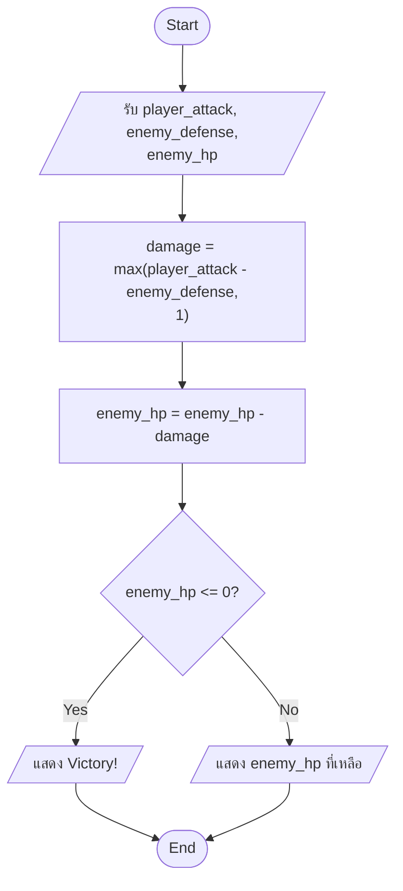
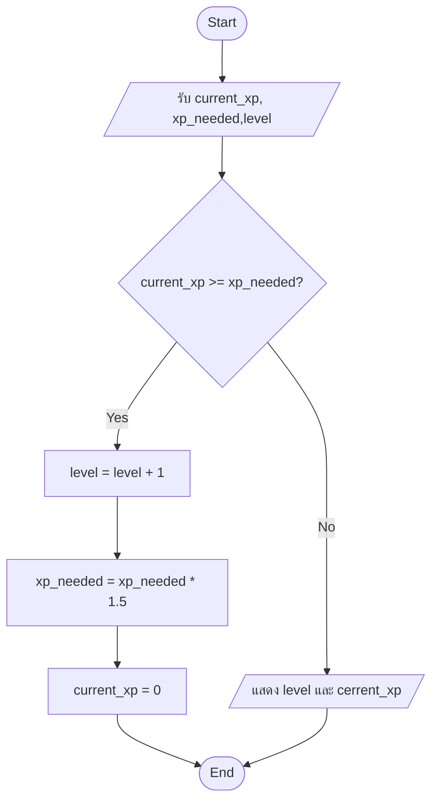
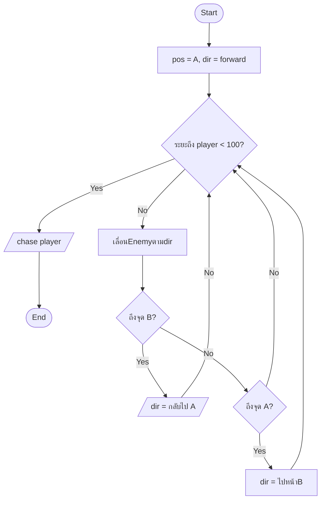

```mermaid
flowchart TD
Start([Start]) --> Input[/รับ player_attack, enemy_defense,
enemy_hp/]
Input --> Calc["damage = max(player_attack - enemy_defense,
1)"]
Calc --> Reduce["enemy_hp = enemy_hp - damage"]
Reduce --> D1{enemy_hp <= 0?}
D1 -->|Yes| Win[/แสดง Victory!/]
D1 -->|No| Show[/แสดง enemy_hp ที่เหลือ/]
Win & Show --> End([End])
```

```mermaid
flowchart TD
Start([Start]) --> Input[/รับ current_xp, xp_needed,level/] -->
 D1{current_xp >= xp_needed?}
D1 -->|Yes| lvl1[level = level + 1] --> lvl2[xp_needed = xp_needed * 1.5] --> lvl3[current_xp = 0] 
D1 -->|No| Show[/แสดง level และ cerrent_xp/]
lvl3 & Show --> End([End])

```

```mermaid
flowchart TD
Start([Start]) --> Input[pos = A, dir = forward] -->
D1{ระยะถึง player < 100?}
D1 -->|Yes| chase[/chase player/] --> End([End])
D1 -->|No| enemy[เลื่อนEnemyตามdir]
enemy --> D2{ถึงจุด B?}
D2 -->|Yes| dir[/dir = กลับไป A/]
dir --> |No| D1
D2 -->|No| A{ถึงจุด A?}
A --> |Yes| dir2[dir = ไปหน้าB]
A --> |No| D1
dir2 --> D1
```
